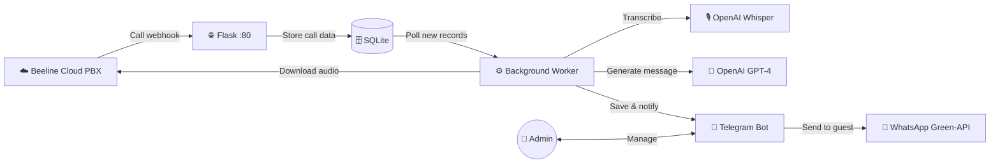
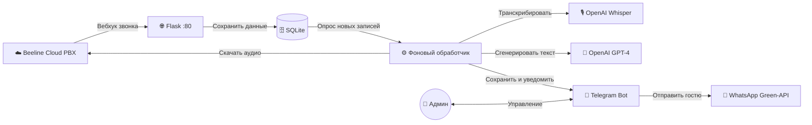

<div align="center">

# 🎮 AI Reservation Helper

<p>
  <strong>AI-powered reservation assistant for computer club administrators</strong><br>
  <strong>AI-помощник по бронированию для администраторов компьютерного клуба</strong>
</p>

<p>
  <a href="https://python.org"></a>
  <a href="https://openai.com"></a>
  <a href="https://core.telegram.org/bots"></a>
  <a href="https://green-api.com"></a>
  <a href="https://flask.palletsprojects.com"></a>
  <a href="https://docker.com"></a>
  <a href="LICENSE"></a>
</p>

---

<p>
  <a href="#-english"><strong>English</strong></a> · <a href="#-русский"><strong>Русский</strong></a>
</p>

</div>

---

<!-- ═══════════════════════════════════════════════════════════ -->
<!--                        ENGLISH                            -->
<!-- ═══════════════════════════════════════════════════════════ -->

<a id="en"></a>

## 🇬🇧 English

### 📖 Table of Contents

- [Overview](#en-overview)
- [Key Features](#en-features)
- [Architecture](#en-architecture)
- [Quick Start — Docker](#en-docker)
- [Manual Installation](#en-manual)
- [Configuration](#en-config)
- [Integration Setup](#en-integrations)
- [How It Works](#en-workflow)
- [Project Structure](#en-structure)
- [License](#en-license)

---

<a id="en-overview"></a>

### 🔎 Overview

**AI Reservation Helper** is a compact backend service designed for computer club administrators. It automates the entire reservation confirmation pipeline: from incoming phone calls to sending a polished booking confirmation to the guest via WhatsApp.

The service listens for call events from **Beeline Cloud PBX**, downloads and transcribes recordings with **OpenAI Whisper**, generates a structured booking message using **GPT-4**, and delivers it through a **Telegram bot** admin panel with one-click WhatsApp delivery via **Green-API**.

Originally built for the **Lockers** computer club, but easily adaptable to any venue.

---

<a id="en-features"></a>

### ✨ Key Features

| Feature | Description |
| :--- | :--- |
| 📞 **Call Tracking** | Automatic webhook processing from Beeline Cloud PBX |
| 🎙️ **Audio Transcription** | Call recordings transcribed to text via OpenAI Whisper |
| 🤖 **Smart Message Generation** | GPT-4.1-nano generates structured reservation confirmations from transcriptions |
| 💬 **WhatsApp Delivery** | One-click message delivery to guests through Green-API |
| 🤳 **Telegram Admin Panel** | Full management via inline buttons: send, edit, delete messages |
| 📝 **Text-based Reservations** | Paste any chat conversation — get an instant booking template |
| 🔄 **Auto-renewing Subscriptions** | PBX event subscriptions are renewed automatically before expiry |
| 🐳 **Docker Ready** | Containerized deployment with a single command |

---

<a id="en-architecture"></a>

### 🏗️ Architecture



**Components:**

| Component | Role |
| :--- | :--- |
| **Flask Server** | Receives webhook events from Beeline PBX at `/subscription` |
| **SQLite Database** | Stores settings, call records, transcriptions, and generated messages |
| **Background Worker** | Downloads recordings, calls OpenAI APIs, auto-renews subscriptions |
| **Telegram Bot** | Admin interface with inline buttons for managing reservations |
| **Green-API** | Sends finalized booking messages to guests on WhatsApp |

---

<a id="en-docker"></a>

### 🐳 Quick Start — Docker

> **Prerequisites:** [Docker](https://docs.docker.com/get-docker/) and [Docker Compose](https://docs.docker.com/compose/install/) installed.

**1. Clone the repository**

```bash
git clone https://github.com/chadoyev/ai_reservation_helper.git
cd ai_reservation_helper
```

**2. Create the environment file**

```bash
cp .env.example .env
```

**3. Fill in your credentials in `.env`**

Open `.env` in any text editor and set all required values (see [Configuration](#en-config)).

**4. Build and run**

```bash
docker compose up -d --build
```

**5. Verify**

```bash
docker compose logs -f
```

The Flask server will be listening on port `80`, and the Telegram bot will start in a background thread.

**Useful commands:**

```bash
docker compose down          # Stop the service
docker compose restart       # Restart
docker compose logs -f       # Follow logs
```

---

<a id="en-manual"></a>

### 🛠️ Manual Installation

**1. Clone and enter the project directory**

```bash
git clone https://github.com/chadoyev/ai_reservation_helper.git
cd ai_reservation_helper
```

**2. Create and activate a virtual environment**

```bash
python -m venv venv

# Windows
venv\Scripts\activate

# Linux / macOS
source venv/bin/activate
```

**3. Install dependencies**

```bash
pip install -r requirements.txt
```

**4. Create the environment file**

```bash
cp .env.example .env
```

Fill in all required values (see [Configuration](#en-config)).

**5. Run**

```bash
python main.py
```

On first launch, the SQLite database `db.db` and the `records/` directory are created automatically.

---

<a id="en-config"></a>

### ⚙️ Configuration

All settings are loaded from environment variables (`.env` file supported via `python-dotenv`).

| Variable | Required | Default | Description |
| :--- | :---: | :--- | :--- |
| `ATS_TOKEN` | ✅ | — | Beeline Cloud PBX API auth token |
| `PHONE_ATS` | ✅ | — | Internal PBX account number |
| `OPENAI_API_KEY` | ✅ | — | OpenAI API key (GPT-4.1-nano + Whisper) |
| `TELEGRAM_TOKEN` | ✅ | — | Telegram bot token from @BotFather |
| `ADMIN_ID` | ✅ | — | Your Telegram user ID (admin access) |
| `GREEN_API_URL` | ✅ | — | Green-API instance URL |
| `GREEN_API_ID_INSTANCE` | ✅ | — | Green-API instance ID |
| `GREEN_API_TOKEN` | ✅ | — | Green-API auth token |
| `PHONE_NUMBER` | ✅ | — | Phone number for WhatsApp auth codes |
| `WEBHOOK_HOST` | ✅ | — | Public domain/IP for PBX webhook callback |
| `FLASK_PORT` | ❌ | `80` | Port for the Flask web server |
| `POLL_INTERVAL` | ❌ | `10` | Background worker polling interval (seconds) |
| `DB_FILE` | ❌ | `db.db` | Path to the SQLite database file |
| `RECORDS_DIR` | ❌ | `records` | Directory for downloaded call recordings |

---

<a id="en-integrations"></a>

### 🔗 Integration Setup

<details>
<summary><strong>☁️ Beeline Cloud PBX</strong></summary>

1. Configure a subscription for call events (`ADVANCED_CALL`) in your Beeline Cloud PBX panel.
2. Set the webhook URL to: `http://<WEBHOOK_HOST>/subscription`
3. Copy the API token and set it as `ATS_TOKEN` in `.env`.

</details>

<details>
<summary><strong>🧠 OpenAI</strong></summary>

1. Get your API key from the [OpenAI dashboard](https://platform.openai.com/api-keys).
2. Set it as `OPENAI_API_KEY` in `.env`.
3. The project uses:
   - `gpt-4.1-nano` — for generating reservation messages
   - `whisper-1` — for audio transcription

</details>

<details>
<summary><strong>📱 Green-API (WhatsApp)</strong></summary>

1. Register at [Green-API](https://green-api.com) and create an instance.
2. Copy instance URL, ID, and token into `.env`:
   - `GREEN_API_URL`
   - `GREEN_API_ID_INSTANCE`
   - `GREEN_API_TOKEN`
3. Set `PHONE_NUMBER` to the phone used for authorization.

</details>

<details>
<summary><strong>🤖 Telegram Bot</strong></summary>

1. Create a bot via [@BotFather](https://t.me/BotFather) and get the token.
2. Set `TELEGRAM_TOKEN` in `.env`.
3. Find your user ID (e.g., via [@userinfobot](https://t.me/userinfobot)) and set `ADMIN_ID`.

</details>

---

<a id="en-workflow"></a>

### 🔄 How It Works

```
┌─────────────────┐     webhook     ┌──────────────────┐
│  Guest calls the │ ──────────────► │  Flask receives   │
│  computer club   │                 │  call event       │
└─────────────────┘                 └────────┬─────────┘
                                             │ save to DB
                                             ▼
                                    ┌──────────────────┐
                                    │ Background Worker │
                                    │  • download audio │
                                    │  • transcribe     │
                                    │  • generate msg   │
                                    └────────┬─────────┘
                                             │ notify
                                             ▼
                                    ┌──────────────────┐
                                    │  Telegram Bot     │
                                    │  [Send] [Edit]    │
                                    │  [Delete]         │
                                    └────────┬─────────┘
                                             │ one click
                                             ▼
                                    ┌──────────────────┐
                                    │  WhatsApp message │
                                    │  sent to guest    │
                                    └──────────────────┘
```

**Step by step:**

1. **Call ends** — Beeline Cloud PBX sends a webhook to the Flask server with the call tracking ID and phone number.
2. **Recording download** — The background worker picks up the new record and downloads the audio file.
3. **Transcription** — Audio is sent to OpenAI Whisper and converted to text.
4. **Message generation** — GPT-4 processes the transcript and fills in a structured reservation template.
5. **Admin review** — The Telegram bot notifies the admin with the generated message and action buttons.
6. **Delivery** — Admin presses "Send" — the message goes to the guest's WhatsApp via Green-API.

**Alternative flow:** Admin pastes a chat conversation directly into the Telegram bot and receives a ready-made booking confirmation template.

---

<a id="en-structure"></a>

### 📁 Project Structure

```
ai_reservation_helper/
├── main.py               # Application entry point (Flask + Telegram bot + worker)
├── requirements.txt      # Python dependencies
├── .env.example          # Environment variables template
├── Dockerfile            # Container image definition
├── docker-compose.yml    # Docker Compose orchestration
├── .dockerignore         # Files excluded from Docker build
├── .gitignore            # Files excluded from Git
├── run.bat               # Windows quick-start script
├── LICENSE               # MIT License
└── README.md             # This file
```

---

<a id="en-license"></a>

### 📄 License

This project is licensed under the [MIT License](LICENSE).

---

<br>

<!-- ═══════════════════════════════════════════════════════════ -->
<!--                        RUSSIAN                            -->
<!-- ═══════════════════════════════════════════════════════════ -->

<a id="ru"></a>

## 🇷🇺 Русский

### 📖 Содержание

- [Обзор](#ru-overview)
- [Ключевые возможности](#ru-features)
- [Архитектура](#ru-architecture)
- [Быстрый старт — Docker](#ru-docker)
- [Ручная установка](#ru-manual)
- [Конфигурация](#ru-config)
- [Настройка интеграций](#ru-integrations)
- [Как это работает](#ru-workflow)
- [Структура проекта](#ru-structure)
- [Лицензия](#ru-license)

---

<a id="ru-overview"></a>

### 🔎 Обзор

**AI Reservation Helper** — это компактный бэкенд-сервис для администраторов компьютерного клуба. Он автоматизирует весь процесс подтверждения бронирования: от входящего звонка до отправки красиво оформленного сообщения гостю в WhatsApp.

Сервис принимает события звонков от **Beeline Cloud PBX**, скачивает и расшифровывает записи через **OpenAI Whisper**, генерирует структурированное сообщение о бронировании с помощью **GPT-4** и доставляет его через панель администратора в **Telegram-боте** с отправкой в WhatsApp через **Green-API** одним нажатием.

Изначально разработан для клуба **Lockers**, но легко адаптируется под любое заведение.

---

<a id="ru-features"></a>

### ✨ Ключевые возможности

| Возможность | Описание |
| :--- | :--- |
| 📞 **Отслеживание звонков** | Автоматическая обработка вебхуков от Beeline Cloud PBX |
| 🎙️ **Транскрипция аудио** | Записи разговоров расшифровываются в текст через OpenAI Whisper |
| 🤖 **Умная генерация сообщений** | GPT-4.1-nano формирует подтверждение бронирования по шаблону |
| 💬 **Отправка в WhatsApp** | Доставка сообщения гостю одним нажатием через Green-API |
| 🤳 **Админ-панель в Telegram** | Полное управление через inline-кнопки: отправить, изменить, удалить |
| 📝 **Бронирование из переписки** | Вставьте любой диалог — получите готовый шаблон бронирования |
| 🔄 **Авто-обновление подписок** | Подписки на события PBX обновляются автоматически |
| 🐳 **Docker Ready** | Контейнеризированный деплой одной командой |

---

<a id="ru-architecture"></a>

### 🏗️ Архитектура



**Компоненты:**

| Компонент | Роль |
| :--- | :--- |
| **Flask-сервер** | Принимает вебхуки от Beeline PBX на `/subscription` |
| **SQLite-база данных** | Хранит настройки, записи звонков, транскрипции и сообщения |
| **Фоновый обработчик** | Скачивает записи, вызывает OpenAI API, обновляет подписки |
| **Telegram-бот** | Админ-интерфейс с inline-кнопками для управления бронированиями |
| **Green-API** | Отправляет итоговые сообщения гостям в WhatsApp |

---

<a id="ru-docker"></a>

### 🐳 Быстрый старт — Docker

> **Требования:** установленные [Docker](https://docs.docker.com/get-docker/) и [Docker Compose](https://docs.docker.com/compose/install/).

**1. Клонируйте репозиторий**

```bash
git clone https://github.com/chadoyev/ai_reservation_helper.git
cd ai_reservation_helper
```

**2. Создайте файл окружения**

```bash
cp .env.example .env
```

**3. Заполните учётные данные в `.env`**

Откройте `.env` в любом текстовом редакторе и задайте все необходимые значения (см. [Конфигурация](#ru-config)).

**4. Соберите и запустите**

```bash
docker compose up -d --build
```

**5. Проверьте работу**

```bash
docker compose logs -f
```

Flask-сервер будет слушать порт `80`, Telegram-бот запустится в фоновом потоке.

**Полезные команды:**

```bash
docker compose down          # Остановить сервис
docker compose restart       # Перезапустить
docker compose logs -f       # Следить за логами
```

---

<a id="ru-manual"></a>

### 🛠️ Ручная установка

**1. Клонируйте репозиторий**

```bash
git clone https://github.com/chadoyev/ai_reservation_helper.git
cd ai_reservation_helper
```

**2. Создайте и активируйте виртуальное окружение**

```bash
python -m venv venv

# Windows
venv\Scripts\activate

# Linux / macOS
source venv/bin/activate
```

**3. Установите зависимости**

```bash
pip install -r requirements.txt
```

**4. Создайте файл окружения**

```bash
cp .env.example .env
```

Заполните все необходимые значения (см. [Конфигурация](#ru-config)).

**5. Запустите**

```bash
python main.py
```

При первом запуске автоматически создадутся SQLite-база `db.db` и директория `records/`.

---

<a id="ru-config"></a>

### ⚙️ Конфигурация

Все настройки загружаются из переменных окружения (поддерживается `.env` файл через `python-dotenv`).

| Переменная | Обязательна | По умолчанию | Описание |
| :--- | :---: | :--- | :--- |
| `ATS_TOKEN` | ✅ | — | Токен авторизации Beeline Cloud PBX |
| `PHONE_ATS` | ✅ | — | Номер внутреннего аккаунта АТС |
| `OPENAI_API_KEY` | ✅ | — | API-ключ OpenAI (GPT-4.1-nano + Whisper) |
| `TELEGRAM_TOKEN` | ✅ | — | Токен Telegram-бота от @BotFather |
| `ADMIN_ID` | ✅ | — | Ваш Telegram user ID (доступ админа) |
| `GREEN_API_URL` | ✅ | — | URL инстанса Green-API |
| `GREEN_API_ID_INSTANCE` | ✅ | — | ID инстанса Green-API |
| `GREEN_API_TOKEN` | ✅ | — | Токен авторизации Green-API |
| `PHONE_NUMBER` | ✅ | — | Номер телефона для кодов авторизации WhatsApp |
| `WEBHOOK_HOST` | ✅ | — | Публичный домен/IP для callback-адреса PBX |
| `FLASK_PORT` | ❌ | `80` | Порт Flask веб-сервера |
| `POLL_INTERVAL` | ❌ | `10` | Интервал опроса фонового обработчика (секунды) |
| `DB_FILE` | ❌ | `db.db` | Путь к файлу SQLite-базы данных |
| `RECORDS_DIR` | ❌ | `records` | Директория для скачанных записей звонков |

---

<a id="ru-integrations"></a>

### 🔗 Настройка интеграций

<details>
<summary><strong>☁️ Beeline Cloud PBX</strong></summary>

1. Настройте подписку на события звонков (`ADVANCED_CALL`) в панели Beeline Cloud PBX.
2. Укажите URL вебхука: `http://<WEBHOOK_HOST>/subscription`
3. Скопируйте API-токен и задайте `ATS_TOKEN` в `.env`.

</details>

<details>
<summary><strong>🧠 OpenAI</strong></summary>

1. Получите API-ключ в [личном кабинете OpenAI](https://platform.openai.com/api-keys).
2. Укажите его как `OPENAI_API_KEY` в `.env`.
3. В проекте используются:
   - `gpt-4.1-nano` — для генерации текстов сообщений
   - `whisper-1` — для транскрипции аудио

</details>

<details>
<summary><strong>📱 Green-API (WhatsApp)</strong></summary>

1. Зарегистрируйтесь в [Green-API](https://green-api.com) и создайте инстанс.
2. Перенесите данные в `.env`:
   - `GREEN_API_URL`
   - `GREEN_API_ID_INSTANCE`
   - `GREEN_API_TOKEN`
3. Укажите `PHONE_NUMBER` — номер для авторизации.

</details>

<details>
<summary><strong>🤖 Telegram-бот</strong></summary>

1. Создайте бота через [@BotFather](https://t.me/BotFather) и получите токен.
2. Задайте `TELEGRAM_TOKEN` в `.env`.
3. Узнайте свой user ID (например, через [@userinfobot](https://t.me/userinfobot)) и задайте `ADMIN_ID`.

</details>

---

<a id="ru-workflow"></a>

### 🔄 Как это работает

```
┌──────────────────┐     вебхук     ┌──────────────────┐
│  Гость звонит в  │ ──────────────► │  Flask принимает  │
│  клуб            │                 │  событие звонка   │
└──────────────────┘                 └────────┬─────────┘
                                              │ сохранение в БД
                                              ▼
                                     ┌──────────────────┐
                                     │ Фоновый обработчик│
                                     │  • скачать аудио  │
                                     │  • транскрибировать│
                                     │  • сгенерировать   │
                                     └────────┬─────────┘
                                              │ уведомление
                                              ▼
                                     ┌──────────────────┐
                                     │  Telegram-бот     │
                                     │  [Отправить]      │
                                     │  [Корректировать]  │
                                     │  [Удалить]         │
                                     └────────┬─────────┘
                                              │ одно нажатие
                                              ▼
                                     ┌──────────────────┐
                                     │  WhatsApp-сообщение│
                                     │  отправлено гостю  │
                                     └──────────────────┘
```

**Пошагово:**

1. **Звонок завершён** — Beeline Cloud PBX отправляет вебхук на Flask-сервер с ID записи и номером телефона.
2. **Скачивание записи** — Фоновый обработчик подхватывает новую запись и скачивает аудиофайл.
3. **Транскрипция** — Аудио отправляется в OpenAI Whisper и преобразуется в текст.
4. **Генерация сообщения** — GPT-4 обрабатывает транскрипцию и заполняет шаблон бронирования.
5. **Проверка админом** — Telegram-бот уведомляет администратора с готовым сообщением и кнопками действий.
6. **Доставка** — Админ нажимает «Отправить» — сообщение уходит гостю в WhatsApp через Green-API.

**Альтернативный сценарий:** Админ вставляет переписку с гостем прямо в Telegram-бот и получает готовый шаблон подтверждения бронирования.

---

<a id="ru-structure"></a>

### 📁 Структура проекта

```
ai_reservation_helper/
├── main.py               # Точка входа (Flask + Telegram-бот + обработчик)
├── requirements.txt      # Python-зависимости
├── .env.example          # Шаблон переменных окружения
├── Dockerfile            # Описание контейнерного образа
├── docker-compose.yml    # Оркестрация Docker Compose
├── .dockerignore         # Файлы, исключённые из Docker-сборки
├── .gitignore            # Файлы, исключённые из Git
├── run.bat               # Скрипт быстрого запуска (Windows)
├── LICENSE               # Лицензия MIT
└── README.md             # Этот файл
```

---

<a id="ru-license"></a>

### 📄 Лицензия

Проект распространяется под лицензией [MIT](LICENSE).

---

<div align="center">
  <sub>Built with ❤️ and OpenAI</sub>
</div>
